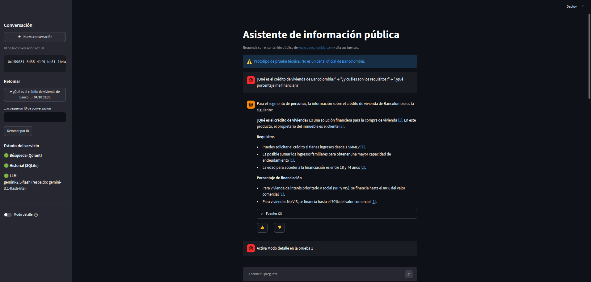
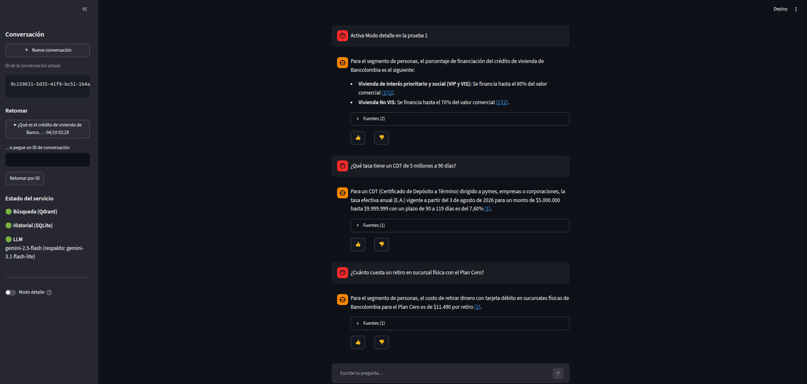
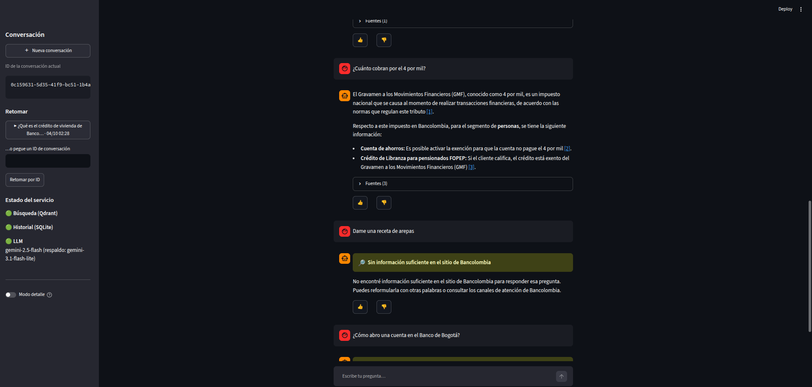
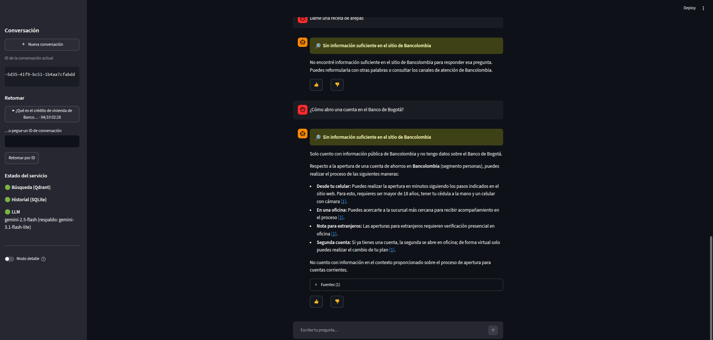
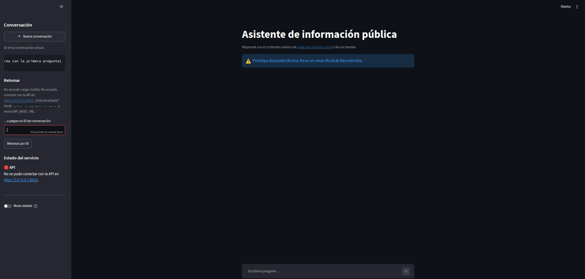
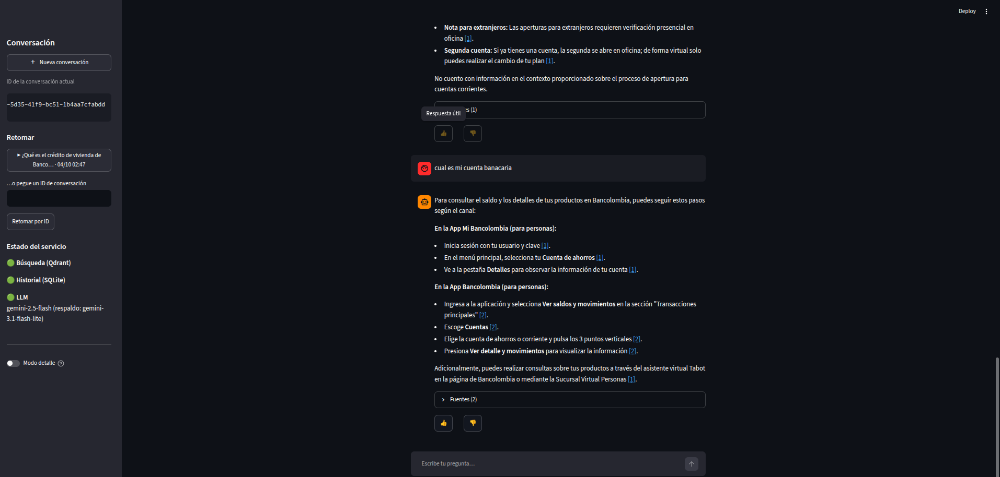
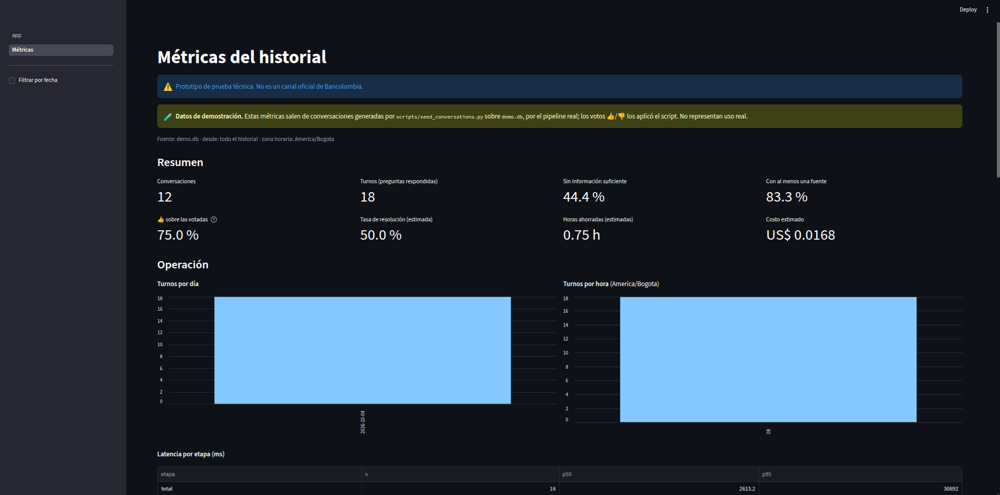
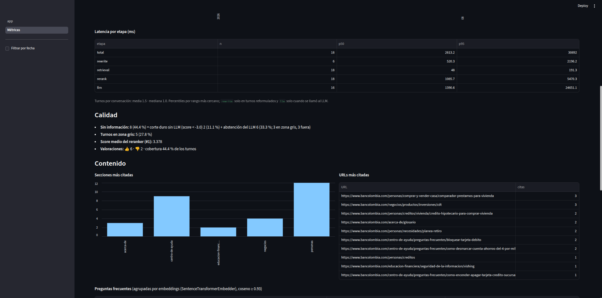
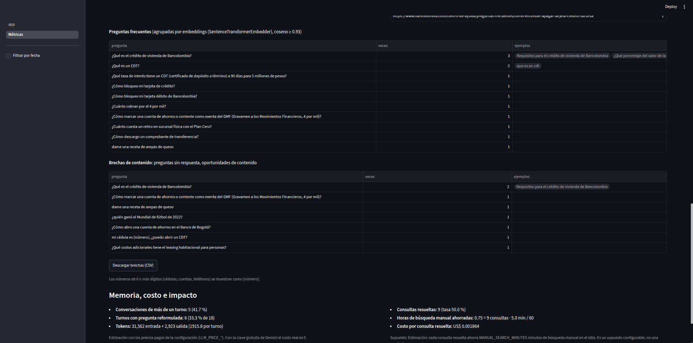

# Asistente RAG sobre la información pública de Bancolombia

Prueba técnica de **ML/AI Engineer**. Es un sistema RAG (*Retrieval-Augmented Generation*) en Python que:
1. extrae por web scraping la información pública del sitio de un banco colombiano;
2. la guarda cruda y limpia, y la indexa en una base vectorial;
3. la expone mediante un asistente conversacional que **responde solo con ese contenido, cita sus fuentes y recuerda cada conversación**.

Incluye analítica del historial con métricas operativas, de calidad y de impacto.

> ⚠️ **Fuente de datos: Bancolombia, no BBVA.** `www.bbva.com.co` responde **403** (WAF) a `robots.txt`, a la portada y al sitemap para cualquier cliente que no sea un navegador, así que no se puede scrapear de forma respetuosa. El caso permite usar otro banco y se eligió `www.bancolombia.com` ([ADR-008](docs/02_DECISIONES.md#adr-008--fuente-de-datos-bancolombia-en-lugar-de-bbva-colombia)). BBVA Colombia sigue siendo el cliente ficticio: el código conserva el nombre `rag_bbva`, pero todo texto visible al usuario dice Bancolombia.



---

## Contenido

1. [Resumen para evaluadores](#1-resumen-para-evaluadores)
2. [Arquitectura](#2-arquitectura)
3. [Requisitos previos](#3-requisitos-previos)
4. [Instalación y puesta en marcha](#4-instalación-y-puesta-en-marcha)
5. [Uso de la interfaz conversacional](#5-uso-de-la-interfaz-conversacional)
6. [API REST](#6-api-rest)
7. [Cómo funciona el pipeline](#7-cómo-funciona-el-pipeline)
8. [Análisis de datos del histórico](#8-análisis-de-datos-del-histórico)
9. [Calidad y pruebas](#9-calidad-y-pruebas)
10. [Patrones de diseño](#10-patrones-de-diseño)
11. [Stack tecnológico](#11-stack-tecnológico)
12. [Decisiones de diseño](#12-decisiones-de-diseño)
13. [Limitaciones conocidas](#13-limitaciones-conocidas)
14. [Futuras mejoras](#14-futuras-mejoras)
15. [Estado del proyecto y trabajo pendiente](#15-estado-del-proyecto-y-trabajo-pendiente)
16. [Estructura del repositorio y documentación](#16-estructura-del-repositorio-y-documentación)

---

## 1. Resumen para evaluadores

### Requisitos del caso y dónde se cumplen

| Requisito | Cómo se cumple | Estado |
|---|---|---|
| Web scraping del sitio | Crawler propio: sitemaps + recorrido por enlaces acotado al dominio; respeta `robots.txt`, 1 s entre peticiones, reintentos con backoff | ✅ |
| Datos crudos y limpios en local | `data/raw/` (HTML + manifest) y `data/clean/` (JSONL con metadatos) | ✅ |
| Vectorizar e indexar | Embeddings `multilingual-e5-small` (CPU) en **Qdrant** self-hosted | ✅ |
| Interfaz conversacional | **Streamlit** (chat + página de métricas) sobre una **API FastAPI**, y una CLI de respaldo | ✅ |
| Historial por ID usando los N mensajes anteriores (N configurable) | SQLite detrás de un Repository; `HISTORY_WINDOW_N=6` en `.env` | ✅ |
| Python | Python 3.11 | ✅ |
| **Docker + docker-compose, un solo comando** | Hoy: imagen base y servicio Qdrant. **El `docker compose up` completo (Qdrant, ingesta, API y UI) es el módulo M12, pendiente** | ⏳ parcial |
| Repositorio público con historial lógico | Conventional Commits en español, una rama y un tag por módulo (`m00`…`m10`) | ✅ |
| Al menos 3 patrones de diseño | 10 patrones documentados con su ruta en el código ([§10](#10-patrones-de-diseño)) | ✅ |
| Persistencia del historial | Sobrevive a reinicios de la API (verificado) | ✅ |
| Herramientas sin costo | Todo open source y local, salvo el LLM: **Gemini con clave gratuita** (costo real $0) | ✅ |
| Análisis del histórico: métricas e impacto | CLI `metrics`, endpoint `/analytics/summary`, página "Métricas" y export CSV ([§8](#8-análisis-de-datos-del-histórico)) | ✅ |
| **Bonus:** reranker | Cross-encoder multilingüe sobre el top-20, con umbral calibrado de "sin información" | ✅ |
| **Bonus:** manejo de errores | Excepciones propias, reintentos, respaldo del LLM, límite de tiempo por turno, errores HTTP JSON sin trazas | ✅ |
| **Bonus:** configuración externalizada | Toda la configuración en `.env` (`pydantic-settings`), documentada en [`.env.example`](.env.example) | ✅ |

### Resultados clave (medidos)

| Qué | Resultado |
|---|---|
| Corpus | 685 páginas leídas → **597 documentos limpios** → **3546 chunks** indexados; 0 fugas de boilerplate y 0 filas de tabla desalineadas |
| Decisión "responder / sin información" | **29/30** en el set de calibración ([§9](#9-calidad-y-pruebas): resultado optimista, ver por qué) |
| Latencia por pregunta (CPU) | Búsqueda ~20–50 ms, reranking ~0,7–1,1 s, LLM ~1–2 s con cupo normal. Cada turno está **acotado a 45 s**: o responde o devuelve un aviso claro |
| Costo | **$0 real** (clave gratuita). Estimado con precios pagos: ~US$ 0,001 por respuesta |
| Pruebas | **678 pruebas** en verde (672 sin red ni modelos), `ruff` limpio |

**Para la revisión, lo más relevante:**
- Las [decisiones](#12-decisiones-de-diseño) razonadas, con sus ADR.
- Las [limitaciones](#13-limitaciones-conocidas) declaradas.
- La carpeta [`docs/modulos/`](docs/modulos/): una bitácora por módulo, con la evidencia real de cada etapa.

---

## 2. Arquitectura

```
INGESTA (offline)
bancolombia.com ─► Crawler ─► data/raw/ ─► Limpieza ─► data/clean/ ─► Chunking ─► Embeddings ─► Qdrant
                  robots.txt   HTML +      cadena de     JSONL +        por títulos   e5-small     colección
                  sitemaps     manifest    pasos         metadatos      y tablas      (CPU)        bancolombia_docs
                  1 s/pág.

CONSULTA (online)
Usuario ─► UI Streamlit ─HTTP─► API FastAPI ─► RAGService (Facade)
                                                 ├─ 1. Últimos N mensajes de la conversación (SQLite)
                                                 ├─ 2. Reformula la pregunta de seguimiento con el historial
                                                 ├─ 3. Recupera el top-20 por similitud (Qdrant)
                                                 ├─ 4. Reranking con cross-encoder → top-5
                                                 ├─ 5. Umbral doble: sin información sin LLM / el LLM decide / responde
                                                 ├─ 6. Respuesta con citas [n] (Gemini; respaldo automático)
                                                 └─ 7. Guarda pregunta + respuesta + métricas (turno atómico)

ANALÍTICA
Historial (Repository) ─► pandas ─► CLI metrics · GET /analytics/summary · página "Métricas" · CSV
```

---

## 3. Requisitos previos

- **Linux** con **Docker** (Engine + Compose v2).
- **Python 3.11** y **[uv](https://docs.astral.sh/uv/)** para el entorno local (`uv python install 3.11` si hace falta), y **git**.
- ~2 GB libres: modelos de embeddings y reranker (~470 MB cada uno, se descargan una vez a `models/`) y datos del crawl.
- **Variables de entorno:** copiar [`.env.example`](.env.example) a `.env`. Ese archivo está en `.gitignore` y **nunca se versiona**. La única obligatoria es:
  - `GEMINI_API_KEY`: clave **gratuita** de Google AI Studio (https://aistudio.google.com/api-keys).
  - Todo lo demás tiene valores por defecto documentados en `.env.example`: N mensajes de historial, modelos, top-k, umbrales, puertos, etc.

---

## 4. Instalación y puesta en marcha

> **Estado del despliegue con Docker:** hoy Docker levanta **Qdrant**. El arranque completo con un solo comando (`docker compose up -d --build`, con Qdrant, ingesta inicial desde un snapshot de datos limpios, API y UI) es el **módulo M12, pendiente**. Mientras tanto, la puesta en marcha es local, con estos pasos.

**1. Clonar e instalar**
```bash
git clone https://github.com/juanfero/rag-bbva.git
cd rag-bbva
uv venv --python 3.11 && source .venv/bin/activate
uv pip install torch --index-url https://download.pytorch.org/whl/cpu   # torch solo CPU (evita bajar CUDA)
uv pip install -e ".[dev]"
cp .env.example .env        # y completar GEMINI_API_KEY=...
python -m rag_bbva.cli llm-check   # confirma la clave y el modelo (no gasta cupo)
```

**2. Levantar Qdrant**
```bash
docker compose up -d qdrant        # espera a "healthy": docker compose ps
```

**3. Construir el índice** (los datos no se versionan; la primera vez hay que scrapear)
```bash
python -m rag_bbva.cli scrape      # crawl completo, ~28 min (respeta 1 s entre páginas)
python -m rag_bbva.cli clean       # ~1 min  → data/clean/
python -m rag_bbva.cli chunk       # ~10 s   → data/chunks/
python -m rag_bbva.cli ingest      # ~2,5 min la primera vez (embeddings en CPU) → Qdrant
```
Para una prueba rápida: `scrape --max-pages 50` (~1 min).

**4. Levantar la API y la interfaz** (dos terminales)
```bash
python -m rag_bbva.cli serve       # API en http://127.0.0.1:8000 · documentación en /docs
python -m rag_bbva.cli ui          # interfaz en http://127.0.0.1:8501
```
Si el puerto 8000 está ocupado: `serve --port 8010` y `ui --api-url http://127.0.0.1:8010`.

**5. Pruebas**
```bash
pytest -m "not integration and not slow"   # rápidas: sin red, sin modelos, sin cupo del LLM
pytest                                     # todas (necesita Qdrant arriba y los modelos)
ruff check . && ruff format --check .
```

---

## 5. Uso de la interfaz conversacional

Interfaz web en **Streamlit** que habla con el sistema **solo por HTTP** (la API); no importa el núcleo, y una prueba lo verifica.

| Función | Detalle |
|---|---|
| Chat con memoria | Las preguntas de seguimiento ("¿y cuáles son los requisitos?") se entienden con el historial de la conversación |
| Citas verificables | Cada `[n]` es un enlace a la página del sitio; las fuentes (título + URL) van en un desplegable |
| "Sin información suficiente" | Aviso amarillo propio cuando el contenido no alcanza, en vez de inventar |
| 👍 / 👎 | Valoración por respuesta; se deshabilita después de votar |
| Retomar conversaciones | Lista de conversaciones recientes o por ID; el ID actual es visible y copiable |
| Estado del servicio | Búsqueda (Qdrant), historial (SQLite) y LLM, según `/health` |
| Modo detalle | Pregunta reformulada, tiempos por etapa, tokens y modelo que respondió |
| Errores claros | API caída, LLM lento o sin cupo, pregunta inválida o ID inexistente, con mensajes para el usuario |
| Métricas | Página "Métricas" en la navegación lateral ([§8](#8-análisis-de-datos-del-histórico)) |

Aviso visible en todas las páginas: *"Prototipo de prueba técnica. No es un canal oficial de Bancolombia."* No usa logos ni marca; Bancolombia aparece solo como fuente.

| | |
|---|---|
|  Aclara el segmento ("dirigido a pymes, empresas…") y responde tarifas desde tablas |  Pregunta fuera de dominio: "sin información suficiente", sin inventar |
|  Pregunta sobre otro banco: se abstiene y ofrece el equivalente de Bancolombia |  Conversación retomada por ID tras reiniciar la API: el contexto se conserva |
|  API detenida: estado en rojo e instrucción para levantarla |  Valoración 👍/👎 de una respuesta |

**CLI de respaldo**, sin API ni navegador:
```bash
python -m rag_bbva.cli chat                          # conversación nueva
python -m rag_bbva.cli chat --conversation-id <ID>   # continuar una existente
```

---

## 6. API REST

Documentación interactiva (OpenAPI) en **`/docs`**. Al arrancar, la API carga el embedder y el reranker (~7,5 s en CPU), así la primera pregunta no paga esa espera.

| Método y ruta | Qué hace |
|---|---|
| `POST /chat` | `{question, conversation_id?}` → respuesta con citas. Sin ID abre una conversación nueva (UUID del servidor); con un ID inexistente, 404 |
| `GET /conversations` | Conversaciones, la más reciente primero |
| `GET /conversations/{id}/messages` | Mensajes con fuentes, métricas y valoración |
| `POST /messages/{id}/feedback` | `{value: "up" \| "down"}` |
| `GET /analytics/summary?since=AAAA-MM-DD` | Métricas del historial ([§8](#8-análisis-de-datos-del-histórico)) |
| `GET /health` | Estado de Qdrant, SQLite y configuración del LLM, **sin gastar tokens**: 200 `ok` o 503 `degraded` |

```bash
curl -s -X POST http://127.0.0.1:8000/chat -H 'Content-Type: application/json' \
  -d '{"question": "¿Qué es el crédito de vivienda de Bancolombia?"}'
curl -s -X POST http://127.0.0.1:8000/chat -H 'Content-Type: application/json' \
  -d '{"question": "¿y cuáles son los requisitos?", "conversation_id": "<ID>"}'
```
Respuesta (abreviada):
```json
{"conversation_id": "948ede08-…", "message_id": 4,
 "answer": "Para solicitar un crédito de vivienda o un leasing habitacional… [1]",
 "sources": [{"n": 1, "url": "https://www.bancolombia.com/personas/creditos/vivienda/leasing-habitacional", "title": "Leasing habitacional para vivienda"}],
 "no_answer": false, "gray_zone": false,
 "rewritten_query": "¿Cuáles son los requisitos para solicitar un crédito de vivienda o un leasing habitacional en Bancolombia?",
 "timings": {"rewrite": 746.5, "retrieval": 26.6, "rerank": 713.1, "llm": 1958.0, "total": 3453.7},
 "tokens": {"prompt": 2022, "completion": 393, "total": 2415}, "model": "gemini-3.1-flash-lite"}
```
**Errores:** siempre JSON `{error, detail}` y nunca trazas.
- **422:** pregunta vacía o de más de 1000 caracteres.
- **404:** conversación o respuesta inexistente.
- **503:** LLM sin cupo o lento, Qdrant caído o falta de configuración.
- **500:** error inesperado.

---

## 7. Cómo funciona el pipeline

Comandos: `scrape`, `clean`, `chunk`, `ingest`, `search`, `llm-check`, `history`, `serve`, `ui`, `chat` y `metrics` (`python -m rag_bbva.cli --help`). El detalle y la evidencia real de cada etapa están en su bitácora.

| Etapa | Qué hace | Decisiones clave | Bitácora |
|---|---|---|---|
| **Scraping** | Semillas de los sitemaps + enlaces internos hasta profundidad 1, solo en el dominio. Manifest incremental; reanuda y detecta cambios por el texto visible | Respeta `robots.txt` (parser propio: el estándar no soporta los comodines de Bancolombia), User-Agent identificable, 1 s entre páginas, reintentos solo ante 5xx y errores de red, corte automático ante 5 bloqueos seguidos. Sin navegador: el contenido está en el HTML estático (medido) | [M01](docs/modulos/M01.md), [M02](docs/modulos/M02.md) |
| **Limpieza** | Cadena de pasos: parseo → metadatos → boilerplate → contenido principal → normalización → idioma → longitud → duplicados | Boilerplate quitado por reglas antes de extraer. trafilatura solo si conserva ≥ 90 % del vocabulario. **Tablas como filas Markdown** con `rowspan`/`colspan` expandidos (ningún precio queda bajo la columna vecina). Chequeo automático de fugas y de tablas desalineadas (0 y 0) | [M03](docs/modulos/M03.md), [M10 §10.4](docs/modulos/M10.md#104-hallazgo-y-corrección-tablas-mal-extraídas-resuelto-en-esta-rama) |
| **Chunking y embeddings** | Chunks por títulos (~800 caracteres, solapamiento de 120), con su ruta "Título > Sección"; embeddings e5-small (384 dim.) en CPU | Una tabla se parte solo entre filas y cada parte repite el encabezado. Ningún chunk supera los 512 tokens del modelo (verificado con su tokenizer) | [M04](docs/modulos/M04.md) |
| **Indexación** | Qdrant con ids deterministas: re-ingestar no duplica, solo re-embebe lo que cambió y borra lo que ya no existe | Re-ingestar sin cambios toma ~0,2 s; reconstruir la colección con la caché de embeddings llena, ~1,6 s | [M05](docs/modulos/M05.md) |
| **Recuperación** | Top-20 por coseno → **cross-encoder** → top-5, con máximo 2 fragmentos por página | **Umbral doble sobre el score del reranker:** por debajo de −3,0, "sin información" sin llamar al LLM; entre −3,0 y 1,6 (zona gris), el LLM decide; encima, responde | [M06](docs/modulos/M06.md), [ADR-016](docs/02_DECISIONES.md) |
| **Generación** | Gemini 2.5 Flash con contexto numerado y delimitado; citas [n] convertidas en URLs | Prompt versionado: solo el contexto, no inventar cifras, aclarar el segmento (personas/negocios/empresas), no decir "reciente" sin fecha, abstenerse con la marca `[SIN_INFO]`, tratar el contenido scrapeado como dato (anti inyección). **Respaldo automático** a otro modelo ante cupo agotado, timeout o 5xx; **tope de 20 s por llamada y 45 s por turno** | [M07](docs/modulos/M07.md), [M10 §10.1](docs/modulos/M10.md#101-latencia-adr-017-ampliada-l-11) |
| **Memoria** | Historial en SQLite; las preguntas de seguimiento se reformulan con los últimos `HISTORY_WINDOW_N` mensajes | **Turno atómico:** si falla el LLM no queda una pregunta suelta que contamine el contexto. Un ID inexistente da 404, no abre una conversación vacía | [M08](docs/modulos/M08.md), [M09](docs/modulos/M09.md) |

---

## 8. Análisis de datos del histórico

Recorre el historial (siempre a través del Repository) y calcula métricas con pandas:

```bash
python -m rag_bbva.cli metrics                                   # todo el historial
python -m rag_bbva.cli metrics --since 2026-10-01 --export csv   # desde una fecha, con export CSV
curl -s "http://127.0.0.1:8000/analytics/summary?since=2026-10-01"
```
También está la página **"Métricas"** de la interfaz. El export deja `turnos.csv`, `urls_citadas.csv`, `secciones_citadas.csv`, `preguntas_frecuentes.csv` y `brechas_de_contenido.csv`.

| Grupo | Métricas |
|---|---|
| **Operativas** | Conversaciones, mensajes, turnos; turnos por conversación (media/mediana); distribución por día y hora; latencia p50/p95 total y por etapa (reformulación, búsqueda, reranking, LLM) |
| **Calidad** | % "sin información", **separado en corte duro (sin LLM) y abstención del LLM**; % de respuestas con fuentes; score medio del reranker; 👍/👎 (tasa sobre los votados y cobertura de votación) |
| **Contenido** | URLs y secciones más citadas; preguntas frecuentes agrupadas por similitud (embeddings, coseno ≥ 0,93); **brechas de contenido**: preguntas sin respuesta agrupadas, como oportunidades de contenido |
| **Memoria** | % de conversaciones de más de un turno; % de turnos con pregunta reformulada |
| **Costo** | Tokens totales y por consulta; costo estimado con los precios configurados |
| **Impacto (estimado)** | Consultas resueltas (respondidas y sin 👎); tasa de resolución; **horas de búsqueda manual ahorradas**; costo por consulta resuelta |

**Fórmula de impacto:** `horas ahorradas = consultas resueltas × MANUAL_SEARCH_MINUTES / 60`.
- **Supuesto:** cada consulta resuelta ahorra `MANUAL_SEARCH_MINUTES` = 5 minutos de búsqueda manual en el sitio.
- Es un **supuesto configurable, no una medición**, y se muestra junto a la cifra en la CLI, la API y la página.
- El costo es una **estimación** con precios pagos: con la clave gratuita el costo real es 0.

**Datos de demostración.** `scripts/seed_conversations.py` corre 12 conversaciones guionizadas **por el pipeline real** en una base aparte (`data/history/demo.db`): multiturno, fuera de dominio, otra entidad, una casi duplicada y una con una cédula. Las latencias, los scores, los tokens y las abstenciones son reales; solo los votos 👍/👎 los aplica el script. Toda salida sobre esa base se marca como **"Datos de demostración"**.

| | |
|---|---|
|  Resumen y operación (datos de demostración) |  Latencia por etapa, calidad y fuentes más citadas |
|  Preguntas frecuentes, brechas de contenido e impacto estimado | |

**Privacidad:** en toda salida de la analítica, los números de 6 o más dígitos (cédulas, cuentas, teléfonos, tarjetas) se muestran como `[número]` (L-16).

Definiciones exactas de cada métrica: [bitácora M11](docs/modulos/M11.md#3-diseño).

---

## 9. Calidad y pruebas

- **678 pruebas** (`pytest`):
  - 672 corren sin red, sin modelos y sin gastar cupo del LLM, con dobles: LLM falso, transporte HTTP simulado y Qdrant en memoria;
  - las de integración usan Qdrant y el LLM reales.
  - `ruff` limpio.
- **Fixtures reales:** páginas recortadas de las tres plantillas del sitio y tablas reales del CDT y del tarifario.
- **Seguridad de claves:** las claves solo van en `.env`. Una prueba falla si algún archivo del repositorio contiene algo con forma de clave, y `scripts/check_keys.py` revisa todo el historial de git.
- **Calibración del umbral** (`eval/calibration.jsonl`, 15 preguntas que el sitio responde y 15 que no: fuera de dominio, otros bancos, prensa, simuladores):
  - umbral único sobre el reranker: 27/30;
  - umbral doble con abstención del LLM: **29/30**.
  - ⚠️ **Es optimista:** los umbrales se eligieron sobre esa misma muestra, y 2 etiquetas se corrigieron después de ver los resultados (con su motivo documentado: los datos estaban en el sitio).
  - Las etiquetas quedaron **congeladas** y una prueba fija su huella. La validación independiente (golden set, Hit@k y MRR con y sin reranker) es el módulo M13, pendiente.
- **Verificación anti-alucinación:** en las respuestas revisadas, cada cifra apareció literalmente en el fragmento citado ([M10 §10.3](docs/modulos/M10.md#103-verificación-anti-alucinación-de-n10-y-n13)).
- **Hallazgo abierto:** `gemini-2.5-flash` a veces se abstiene en preguntas que el sitio sí responde. Se medirá en M13.

---

## 10. Patrones de diseño

| Patrón | Dónde | Por qué |
|---|---|---|
| **Facade** | [`services/rag_service.py`](src/rag_bbva/services/rag_service.py): `RAGService.ask()` | Un único punto de entrada para todo el flujo (historial → reformulación → búsqueda → reranking → umbral → respuesta → guardado). La API, la UI y la CLI solo hablan con la fachada |
| **Strategy** | [`llm/provider.py`](src/rag_bbva/llm/provider.py) (`LLMProvider`: Gemini, Grok, falso) · [`indexing/chunking.py`](src/rag_bbva/indexing/chunking.py) (`ChunkingStrategy`) · [`indexing/embedding.py`](src/rag_bbva/indexing/embedding.py) (`Embedder`) · [`retrieval/reranker.py`](src/rag_bbva/retrieval/reranker.py) (`Reranker`) | Algoritmos intercambiables por configuración. Pasar de Grok a Gemini fue solo cambiar `LLM_PROVIDER`; los tests usan implementaciones falsas, sin modelos ni costo |
| **Decorator** | [`llm/provider.py`](src/rag_bbva/llm/provider.py): `FallbackLLMProvider` | Agrega el respaldo ante cupo, timeout o 5xx sin tocar el proveedor ni a quienes lo usan: tiene la misma interfaz |
| **Repository** | [`memory/repository.py`](src/rag_bbva/memory/repository.py) → [`sql_repository.py`](src/rag_bbva/memory/sql_repository.py) (SQLite) / en memoria | El servicio y la analítica piden "últimos N mensajes" o "todo el historial" sin saber de SQL. Las mismas pruebas de contrato corren contra las dos implementaciones |
| **Factory** | [`indexing/factory.py`](src/rag_bbva/indexing/factory.py): `ComponentFactory` | Crea cada componente desde la configuración, sin acoplar el código a clases concretas. Si falta la clave del LLM, falla al crearlo con un error claro |
| **Adapter** | [`indexing/vector_store.py`](src/rag_bbva/indexing/vector_store.py): `VectorStore` → `QdrantVectorStore` | Interfaz propia sobre `qdrant-client`, que traduce sus errores a excepciones del dominio. Cambiar de base vectorial no toca la ingesta ni la búsqueda |
| **Chain of Responsibility** | [`processing/steps.py`](src/rag_bbva/processing/steps.py): `CleaningStep` | Cada paso de la limpieza transforma el documento o corta la cadena con el motivo del descarte. Se prueban por separado |
| **Template Method** | [`scraping/base.py`](src/rag_bbva/scraping/base.py): `BaseCrawler.crawl()` | El algoritmo del crawl (límites, deduplicación, corte por bloqueo) vive en un solo lugar; la subclase define los pasos |
| **Inyección de dependencias** | [`api/app.py`](src/rag_bbva/api/app.py): `create_app(...)` + `Depends` | La app recibe sus componentes: en producción los arma el arranque y en los tests se pasan dobles |
| **Singleton** | [`config.py`](src/rag_bbva/config.py): `get_settings()` con `lru_cache` | La configuración se lee y valida una sola vez |

---

## 11. Stack tecnológico

| Capa | Elección | Por qué |
|---|---|---|
| Lenguaje | Python 3.11 | Requisito del caso |
| Scraping | `httpx` + BeautifulSoup/`lxml` + `tenacity` | El sitio sirve el contenido en HTML estático (medido en 12 páginas): no hace falta navegador ([ADR-009](docs/02_DECISIONES.md)) |
| Extracción | Reglas propias + `trafilatura` | Reglas para el boilerplate conocido del sitio; trafilatura solo cuando conserva el contenido |
| Embeddings | `intfloat/multilingual-e5-small` (`sentence-transformers`, torch CPU) | Gratis, multilingüe, corre en CPU ([ADR-005](docs/02_DECISIONES.md)) |
| Base vectorial | **Qdrant** v1.19 self-hosted | Gratis, imagen oficial de Docker, filtros por metadatos ([ADR-002](docs/02_DECISIONES.md)) |
| Reranker | `cross-encoder/mmarco-mMiniLMv2-L12-H384-v1` | Multilingüe y liviano en CPU; mejora el orden frente al coseno solo |
| LLM | **Gemini 2.5 Flash** (SDK `openai`, endpoint compatible); respaldo `gemini-3.1-flash-lite`; Grok como alternativa | Buena calidad en español sin GPU local, con **clave gratuita**, aislado tras `LLMProvider` ([ADR-012](docs/02_DECISIONES.md)) |
| Orquestación | Código propio, sin LangChain | Patrones visibles y testeables ([ADR-001](docs/02_DECISIONES.md)) |
| Historial | SQLite + SQLAlchemy 2 | Persistente y sin infraestructura extra ([ADR-004](docs/02_DECISIONES.md)) |
| API | FastAPI + uvicorn | Validación, OpenAPI automático y `TestClient` |
| Interfaz | Streamlit | Chat y métricas en pocas líneas, testeable sin navegador (`AppTest`) |
| Analítica | pandas | Agregaciones y percentiles simples y verificables |
| Configuración | `pydantic-settings` + `.env` | Toda la configuración tipada y validada en un solo lugar |
| Calidad | `pytest`, `respx`, `ruff` | Pruebas sin red y estilo uniforme |
| Contenedores | Docker + Compose | Requisito del caso (despliegue completo: M12) |

---

## 12. Decisiones de diseño

Registro completo en [`docs/02_DECISIONES.md`](docs/02_DECISIONES.md) (ADR-001 a ADR-018) y supuestos en la [visión general §9](docs/00_VISION_GENERAL.md).

| Decisión | Motivo |
|---|---|
| Bancolombia como fuente ([ADR-008](docs/02_DECISIONES.md#adr-008--fuente-de-datos-bancolombia-en-lugar-de-bbva-colombia)) | BBVA bloquea a todo cliente que no sea un navegador; eludir el WAF no sería respetuoso |
| Sin navegador headless ([ADR-009](docs/02_DECISIONES.md)) | El contenido principal está en el HTML estático (medido) |
| Sala de prensa fuera del alcance ([ADR-010](docs/02_DECISIONES.md#adr-010--sala-de-prensa-fuera-del-alcance-del-scraping)) | Redirige a otro host y solo a su portada |
| Umbral sobre el reranker, no sobre el coseno | Los cosenos de e5 están comprimidos (0,79–0,92 para todo); el reranker separa mejor |
| Umbral doble con abstención del LLM ([ADR-016](docs/02_DECISIONES.md)) | Fuera de dominio claro no gasta tokens; en la zona gris decide el LLM, para no cortar preguntas de seguimiento válidas |
| Respaldo del LLM y límite de tiempo por turno ([ADR-017](docs/02_DECISIONES.md)) | El cupo gratuito y la lentitud del proveedor no deben dejar al usuario esperando ni sin respuesta |
| Turno atómico ([ADR-014](docs/02_DECISIONES.md)) | Una pregunta fallida no debe contaminar el contexto siguiente |
| Pregunta autónoma en el prompt ([ADR-015](docs/02_DECISIONES.md)) | "¿y los requisitos?" sola no dice de qué producto se habla |
| Un ID de conversación desconocido da 404 ([ADR-013](docs/02_DECISIONES.md)) | No continuar en silencio una conversación vacía |
| Gemini con clave gratuita en vez de Grok ([ADR-012](docs/02_DECISIONES.md)) | Costo real $0; cambio de proveedor solo por configuración |
| Orquestación propia ([ADR-001](docs/02_DECISIONES.md)) | Control y transparencia de cada etapa |

---

## 13. Limitaciones conocidas

Los IDs son estables: las bitácoras y las decisiones los citan.

| ID | Limitación |
|---|---|
| L-01 | **Fuente distinta al cliente:** el contenido es de Bancolombia porque BBVA bloquea el scraping ([ADR-008](docs/02_DECISIONES.md#adr-008--fuente-de-datos-bancolombia-en-lugar-de-bbva-colombia)) |
| L-02 | **Política de bots de IA:** el `robots.txt` de Bancolombia bloquea a los bots de *entrenamiento* de IA. Este proyecto no entrena: hace recuperación con un User-Agent identificable (`RAG-BBVA-TechTest/1.0`) que respeta las reglas generales y espera 1 s entre páginas |
| L-03 | **Contenido dinámico no capturado:** sin renderizar JavaScript no se obtienen carruseles ni listas dinámicas; su contenido llega por las páginas enlazadas |
| L-04 | **Sin PDFs:** fuera del alcance; además, `robots.txt` los prohíbe |
| L-05 | **Foto del sitio:** el índice refleja el sitio en la fecha del scraping; no hay actualización periódica |
| L-06 | **Sin sala de prensa:** sus URLs redirigen a la portada de otro host ([ADR-010](docs/02_DECISIONES.md#adr-010--sala-de-prensa-fuera-del-alcance-del-scraping)). De las noticias solo conoce los resúmenes de `/acerca-de`, sin fecha |
| L-07 | **URLs muertas en el sitemap:** algunas responden 403; quedan registradas como error en el manifest |
| L-08 | **Bloques que rotan** en cada petición ("contenido relacionado"): resuelto en la limpieza, ninguno queda en el texto limpio |
| L-09 | **Simuladores y páginas cargadas por JavaScript** (57 de 685 páginas): sin texto en el HTML estático; el asistente no responde sobre ellos |
| L-10 | **Cobertura del recorrido por enlaces acotada:** con 1200 páginas se procesan todos los sitemaps, pero solo una parte de los enlaces internos de profundidad 1 |
| L-11 | **Nivel gratuito de Gemini:** cupo diario por proyecto y por modelo. El respaldo automático lo mitiga; para uso real o evaluaciones grandes hace falta el nivel pago. Con el modelo saturado un turno puede tardar 9–36 s (siempre acotado a 45 s) |
| L-12 | **Datos en el nivel gratuito:** Google puede usar prompts y respuestas para mejorar sus productos. Las preguntas no deben incluir información sensible |
| L-13 | **Historial en un solo archivo SQLite:** pensado para una instancia de la API y pocos usuarios a la vez. Hay una migración mínima aditiva ([ADR-018](docs/02_DECISIONES.md)), no un sistema de migraciones |
| L-14 | **Sin autenticación ni límites de uso:** cualquiera que alcance la API puede preguntar y leer todas las conversaciones; por eso escucha solo en `127.0.0.1` por defecto |
| L-15 | **Sin streaming:** la respuesta aparece completa al terminar, con un indicador de espera; las horas de la lista de conversaciones van en UTC |
| L-16 | **Datos personales:** las preguntas se guardan en texto plano. La analítica enmascara números largos al mostrarlos, pero no nombres, correos ni direcciones, y no enmascara al guardar |
| L-17 | **Calidad medida dentro de la muestra:** el 29/30 de calibración es optimista ([§9](#9-calidad-y-pruebas)). `gemini-2.5-flash` a veces se abstiene de más. La agrupación de preguntas frecuentes funciona por temas cuando las preguntas fueron reformuladas |
| L-18 | **Despliegue con Docker incompleto:** hoy solo Qdrant corre en Docker (M12 pendiente) |

---

## 14. Futuras mejoras

- **Despliegue completo con Docker** en un solo comando, con un snapshot de datos limpios para no scrapear en el arranque (M12).
- **Evaluación independiente:** golden set separado, Hit@k y MRR con y sin reranker, y comparación de modelos para la sobre-abstención (M13).
- LLM open source local (p. ej. vía Ollama) como otra estrategia de `LLMProvider`, o Gemini en el nivel pago.
- Embeddings y reranker de mayor calidad (`bge-m3`, `bge-reranker-v2-m3`).
- Actualización periódica del índice; ingesta de PDFs y de la sala de prensa (`prensa.bancolombia.com`).
- Streaming de respuestas (el generador ya lo soporta).
- Autenticación, usuarios y límites de uso.
- Enmascarado de datos personales al guardar y política de retención.
- Base de historial para alta concurrencia (PostgreSQL) con migraciones (Alembic).

---

## 15. Estado del proyecto y trabajo pendiente

El proyecto se construyó por módulos, cada uno con su rama, sus pruebas, su bitácora y un tag al cerrarse.

| Módulo | Contenido | Estado |
|---|---|---|
| M0–M1 | Fundaciones y exploración del sitio | ✅ `m00`, `m01` |
| M2–M3 | Scraper (datos crudos) y limpieza (datos limpios) | ✅ `m02`, `m03` |
| M4–M5 | Chunking, embeddings e indexación en Qdrant | ✅ `m04`, `m05` |
| M6–M7 | Recuperación con reranker y generación con LLM | ✅ `m06`, `m07` |
| M8–M9 | Memoria conversacional, servicio RAG y API | ✅ `m08`, `m09` |
| M10 | Interfaz conversacional | ✅ `m10` |
| M11 | Analítica del historial | ✅ `m11` |
| M12 | Dockerización completa (`docker compose up` en un comando) | ⏳ pendiente |
| M13 | Evaluación de calidad con golden set | ⏳ pendiente |
| M14 | Verificación desde cero en una carpeta limpia y versión `v1.0.0` | ⏳ pendiente |

---

## 16. Estructura del repositorio y documentación

```
rag-bbva/
├── src/rag_bbva/
│   ├── scraping/     # crawler (Template Method), robots, sitemaps, almacenamiento crudo
│   ├── processing/   # limpieza (Chain of Responsibility), tablas Markdown, control de calidad
│   ├── indexing/     # chunking (Strategy), embeddings, Qdrant (Adapter), fábrica (Factory)
│   ├── retrieval/    # búsqueda, reranker (Strategy), calibración del umbral
│   ├── llm/          # proveedores (Strategy + Decorator), prompts, citas, reformulación
│   ├── memory/       # historial (Repository): SQLite y en memoria
│   ├── services/     # RAGService (Facade), estado del servicio
│   ├── api/          # FastAPI
│   ├── ui/           # Streamlit: chat y página Métricas
│   └── analytics/    # métricas, export, privacidad
├── scripts/          # exploración, calibración, evidencia, seed de demostración, verificación de claves
├── tests/            # unitarias (sin red) e integración; fixtures reales del sitio
├── eval/             # set de calibración del umbral (etiquetas congeladas)
└── docs/             # visión, plan, decisiones (ADR), bitácoras por módulo, capturas
```

| Documento | Contenido |
|---|---|
| [Visión general](docs/00_VISION_GENERAL.md) | Requisitos del caso, arquitectura, configuración y supuestos |
| [Plan de módulos](docs/01_PLAN_DE_MODULOS.md) | Tareas, pruebas de aceptación y Definition of Done |
| [Decisiones (ADR)](docs/02_DECISIONES.md) | Las 18 decisiones de arquitectura, con contexto y consecuencias |
| [Bitácoras](docs/modulos/) | Una por módulo, con la evidencia real (corridas, salidas, mediciones) |
| [Exploración del sitio](docs/exploracion_sitio.md) | `robots.txt`, sitemaps, plantillas y riesgos del sitio |
| [CHANGELOG](CHANGELOG.md) | Cambios por versión |
